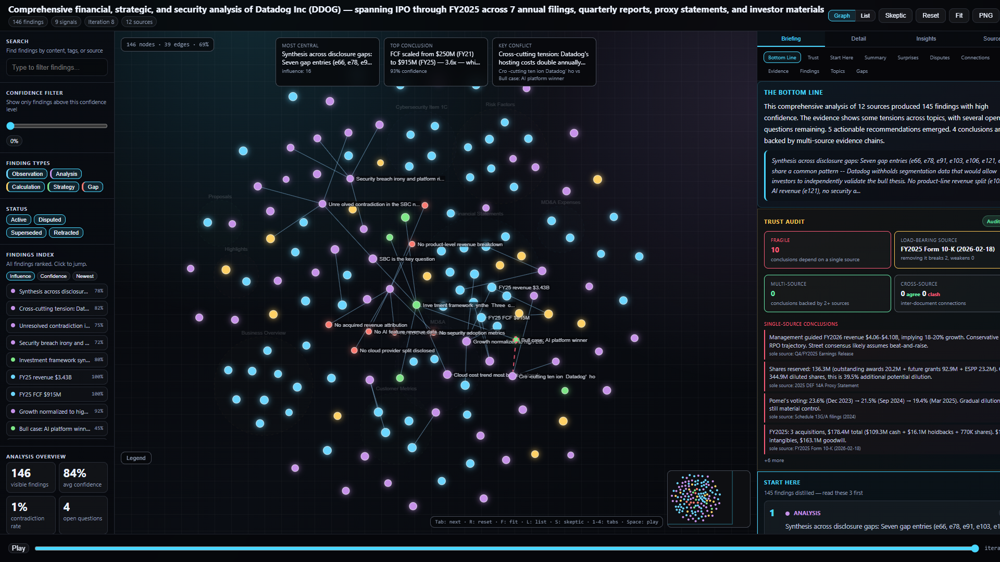
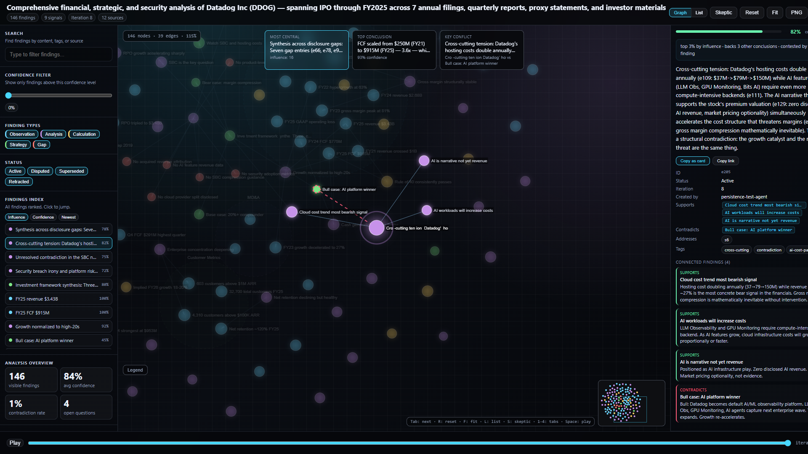
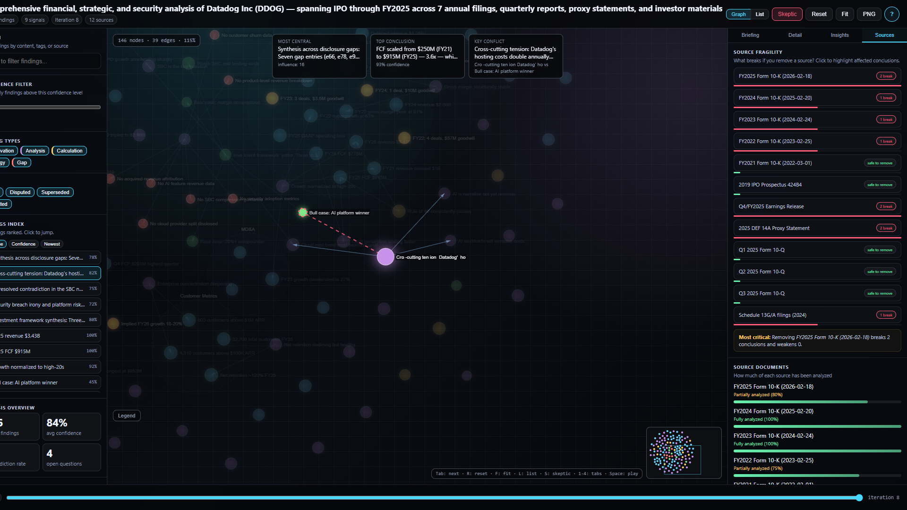

# Blackboard MCP

Persistent structured reasoning for AI agents. Zero API calls, zero cost.

Blackboard MCP gives any AI agent — Claude Code, Codex, or anything that speaks MCP — a shared, typed, provenance-tracked knowledge base that persists across sessions. Instead of treating every interaction as a fresh start, agents build cumulative analytical state: observations grounded in source documents, analyses with confidence scores, calculations with supporting evidence, and gaps that flag what's still missing. The blackboard survives between sessions, so the next agent picks up where the last one left off.

## Contents

- [SWE-bench Verified results](#swe-bench-verified-results)
- [Multi-model scaling experiment](#multi-model-scaling-experiment)
- [Quick start](#quick-start)
- [How it works](#how-it-works)
- [Tools](#tools)
- [Entry types](#entry-types)
- [Relationships](#relationships)
- [Interactive HTML export](#interactive-html-export)
- [Screenshots](#screenshots)
- [Typical workflow](#typical-workflow)
- [Continuing from a previous session](#continuing-from-a-previous-session)
- [Storage](#storage)

## SWE-bench Verified results

On [SWE-bench Verified](https://www.swebench.com/) (500 real GitHub issues), Sonnet 4.6 + Blackboard MCP resolved **73% of evaluated instances** using only a minimal API wrapper — no file navigation, no shell tools, no retry logic. Claude Code's fully-engineered agent scaffold achieves 79.6% with the same model. Codex CLI achieves 69.2% with o4-mini.

A bare-bones scaffold with Blackboard MCP achieved 92% of Claude Code's performance and beat Codex CLI outright. The reasoning quality comes from the blackboard. If you're using Blackboard MCP inside Claude Code or Codex, you're running a better scaffold than what produced these numbers.

Full results: [`benchmarks/swebench/`](../../benchmarks/swebench/)

## Multi-model scaling experiment

We ran a controlled experiment to test whether blackboard state improves output quality — not just cost — across different models. Five configurations (Opus 4.6, Sonnet 4.6, Haiku 4.5, Fable 5 with blackboard, and Fable 5 without) each answered five sequential queries against Datadog's full public SEC filing corpus (1,857 files, 520 MB). Each blackboard-equipped model accumulated state across queries; the control started fresh every time.

The final query — a full investment thesis synthesis requiring integration of product, competitive, financial, and risk analysis — revealed the result:

| Config | Q5 file reads | Q5 tokens | Quality |
|---|---|---|---|
| **Fable 5 + BB** | **0 files** | **86K** | **Best** — cross-referenced BB entries to derive early-warning thesis from filing language shifts |
| Fable 5 (no BB) | 70 pages | 146K | Strong — page-level citations, thorough but no cross-domain connections |
| Opus 4.6 + BB | 0 files | 66K | Strong — structured analysis, identified competitive moat durability |
| Sonnet 4.6 + BB | 5 files | 123K | Competent but generic — template-like despite 32 BB entries |
| Haiku 4.5 + BB | 35 pages | 98K | Material factual errors — wrong revenue multiple, missed $1B debt |

**The blackboard made Fable produce better output than Opus, while reading zero files.** Fable+BB's synthesis included an insight about tracking disclosure language changes across risk factor filings as early warning signals — a connection that emerged from having risk factor data cross-linked with financial trajectory in the blackboard. This kind of structured cross-referencing doesn't happen when reading raw PDFs in isolation.

### What this means

The blackboard is a **quality amplifier**, not just a cost optimization. Structured accumulation forces the model to cross-reference findings across queries, producing analytical connections that wouldn't emerge from a single-pass read. The strongest models (Fable, Opus) leverage this most effectively. Haiku demonstrates the floor: the blackboard can't compensate for a model that makes factual errors during extraction.

### Amortization

Queries 1–4 showed no cost savings because each hit orthogonal sections of the corpus (products, competition, financials, risks). Amortization activated on the synthesis query when accumulated state overlapped with the query's needs. Every additional synthesis query after warming costs near-zero in file reads for blackboard-equipped configs.

| Config | Total tokens (5 queries) | Estimated cost |
|---|---|---|
| Opus 4.6 + BB | 569K | $4.55 |
| Sonnet 4.6 + BB | 684K | $3.29 |
| Haiku 4.5 + BB | 664K | $1.06 |
| Fable 5 + BB | 623K | $9.97 |
| Fable 5 (no BB) | 717K | $11.48 |

Fable+BB used 13% fewer total tokens than the control, and 41% fewer on the synthesis query specifically.

Full experiment outputs: [`examples/datadog-strategic-analysis/comparison/experiment/`](../../examples/datadog-strategic-analysis/comparison/experiment/)

## Quick start

### With Claude Code

Add to your project's `.mcp.json`:

```json
{
  "mcpServers": {
    "blackboard": {
      "type": "stdio",
      "command": "npx",
      "args": ["@irys/blackboard-mcp"]
    }
  }
}
```

### With Codex CLI

```json
{
  "mcpServers": {
    "blackboard": {
      "type": "stdio",
      "command": "npx",
      "args": ["@irys/blackboard-mcp"]
    }
  }
}
```

### From source

```bash
git clone https://github.com/iqidis/ant-irys
cd ant-irys/packages/blackboard-mcp
npm install && npm run build
node dist/index.js
```

## How it works

An agent working on a complex task creates a blackboard, reads documents, and records typed findings. Each finding carries source provenance (which document, which section, what evidence), confidence scores, and explicit relationships to other findings (supports, contradicts, supersedes). Signals flag open questions the agent needs to answer. The blackboard tracks convergence — how close the analysis is to being complete.

When the analysis is done, `bb_export` creates a self-contained interactive HTML visualization you can open in any browser. No server needed.

When a new agent session starts in the same project directory, it calls `bb_list`, finds existing blackboards, and builds on them instead of starting from scratch.

## Tools

Blackboard MCP exposes 14 tools:

### Core workflow

| Tool | What it does |
|------|-------------|
| `bb_create` | Create a new blackboard with a task description |
| `bb_add_document` | Register a document as a source (text content + metadata) |
| `bb_add_entries` | Record findings — observations, analyses, calculations, strategies, gaps |
| `bb_add_signal` | Flag an open question or gap that needs investigation |
| `bb_iterate` | Advance the blackboard to the next iteration |

### Inspection

| Tool | What it does |
|------|-------------|
| `bb_list` | List all blackboards in this project. **Call this first.** |
| `bb_get_state` | Get full blackboard state — entries, signals, documents, health |
| `bb_search` | Search entries by content, type, source, or confidence |
| `bb_mark_read` | Mark a document section as read (tracks reading progress) |

### Synthesis

| Tool | What it does |
|------|-------------|
| `bb_convergence` | Check if the analysis is ready — flags blockers, disputed entries, unread sources |
| `bb_synthesis` | Assemble the final answer from blackboard state — includes must-include entries, disputes, gaps |

### Persistence and visualization

| Tool | What it does |
|------|-------------|
| `bb_snapshot` | Save a named milestone snapshot (e.g., "after initial reading", "pre-synthesis") |
| `bb_diagram` | Generate a Mermaid graph of the reasoning topology |
| `bb_export` | Export an interactive HTML visualization — self-contained, opens in any browser |

## Entry types

Every finding recorded on the blackboard has a type:

| Type | Purpose | Example |
|------|---------|---------|
| `observation` | Source-grounded fact | "Section 2.06 specifies an annual agency fee of $50,000" |
| `analysis` | Interpretation or conclusion | "The agency fee deviates from the commitment letter by $100,000" |
| `calculation` | Derived numeric or logical work | "Total exposure across all facilities: $1.2B" |
| `strategy` | Framing decision or approach | "Compare term sheet against draft clause-by-clause" |
| `gap` | Missing evidence or unresolved work | "SOFR floor not yet extracted from the credit agreement" |

## Relationships

Entries connect to each other explicitly:

- **supports_entries** — this finding backs up another finding
- **contradicts_entries** — this finding conflicts with another
- **supersedes_entries** — this finding replaces an outdated one
- **addresses_signals** — this finding answers an open question
- **opens_questions** — this finding raises a new question

These relationships form a directed graph. The HTML export visualizes this graph interactively — you can see how evidence flows, where contradictions exist, and which conclusions are well-supported vs. fragile.

## Interactive HTML export

`bb_export` produces a self-contained HTML file with:

- **Force-directed graph** — nodes are findings, edges are relationships, colors indicate type
- **Briefing tab** — narrative summary with key conclusions, evidence chains, and contradictions
- **Detail panel** — click any node to see full content, source evidence, confidence, and connected findings
- **Insights tab** — cross-document analysis, reasoning chains, source dependency mapping
- **Sources tab** — document coverage, topic clustering, reading progress
- **Iteration playback** — step through how the analysis evolved over time
- **Filters** — by type, status, confidence threshold, iteration, or search query
- **Keyboard shortcuts** — `1-4` switch tabs, `Tab`/`Shift+Tab` cycle findings, `F` fit view, `Esc` deselect

No server required. Just open the HTML file in a browser.

## Screenshots

**Graph overview with briefing panel** — force-directed graph of 146 findings from a Datadog financial analysis. The briefing tab shows the bottom line, trust audit, and key conclusions with source attribution.



**Node detail panel** — clicking any node reveals full content, confidence score, source provenance, tags, and all connected findings with their relationship types (supports, contradicts).



**Source fragility analysis** — the skeptic lens shows what breaks if you remove each source document. Source coverage bars track reading progress across all documents in the corpus.



## Typical workflow

```
1. Agent calls bb_list → finds no existing blackboards
2. Agent calls bb_create with task description
3. Agent reads documents, calls bb_add_document for each
4. Agent records findings with bb_add_entries
   - Each entry includes type, content, source, confidence
   - Entries link to each other via supports/contradicts/addresses
5. Agent calls bb_add_signal for open questions
6. Agent calls bb_iterate to advance to next iteration
7. Repeat steps 4-6 as understanding deepens
8. Agent calls bb_convergence → checks if analysis is complete
9. Agent calls bb_synthesis → assembles final answer
10. Agent calls bb_export → creates interactive HTML
```

## Continuing from a previous session

```
1. Agent calls bb_list → finds existing blackboard
2. Agent calls bb_get_state → sees what was already recorded
3. Agent adds new entries, resolves open signals, addresses gaps
4. Agent calls bb_convergence → checks updated completeness
5. Agent calls bb_synthesis when ready
```

The blackboard state lives in `.blackboard/` in your project directory. It persists across sessions, across agents, and across tools. Any MCP-compatible agent can read and extend any blackboard in the project.

## Storage

All state is stored as JSON files in `.blackboard/<id>/`:

```
.blackboard/
├── <blackboard-id>/
│   ├── state.json          # Full blackboard state
│   ├── snapshots/          # Named milestone snapshots
│   └── exports/            # HTML visualizations
└── exports/                # Named exports (bb_export with path)
```

No database. No external services. No API calls. Just files on disk.

## License

MIT
